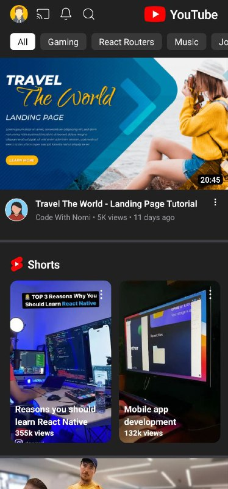

# Youtube Clone Api React Native

## Preview Final Project

#### youtube Screen



## What did we use in the project?
### 1- [React Native Expo](https://reactnative.dev/)
### 2- [NativeWind](https://www.nativewind.dev/)
### 3- [React Navigation](https://reactnavigation.org/)
### 4- [Rapid Api](https://rapidapi.com/)
      Youtube v3 - alternative => https://rapidapi.com/ytdlfree/api/youtube-v3-alternative


## Packages
- npx create-expo-app Youtube-Clone-App
- npm i nativewind
- npm i --dev tailwindcss@3.3.2
- npx tailwindcss init
- npm install @react-navigation/native
- npx expo install react-native-screens react-native-safe-area-context
- npm install @react-navigation/native-stack
- npm i react-native-responsive-screen
- npm i react-native-feather
- npm install axios
- ** npx expo install --fix **
- ** npx expo install **
```
// tailwind.config.js
module.exports = {
- content: [],
+ content: ["./App.{js,jsx,ts,tsx}", "./<custom directory>/**/*.{js,jsx,ts,tsx}"],
  theme: {
    extend: {},
  },
  plugins: [],
}

3. Add the Babel plugin

Modify your babel.config.js

// babel.config.js
module.exports = function (api) {
  api.cache(true);
  return {
    presets: ["babel-preset-expo"],
+   plugins: ["nativewind/babel"],
  };
};
```

## Run The Project
- Download
- Open The Project
- Terminal
- npm i
- npx expo
- -w or Open Expo App On your Phone

